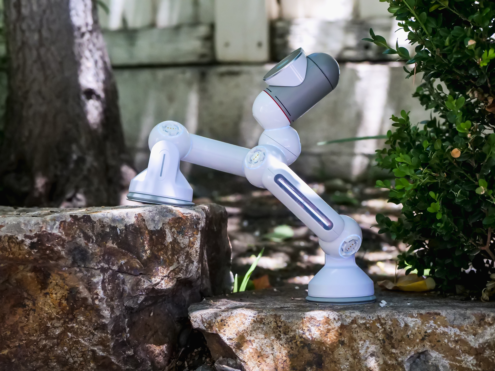

# Hi there, I'm Chris! 👋

  

  
## Projects

- Passion for exploring the intersection of technology and data-driven solutions.
- Strong focus on Data Science and Machine Learning, with a drive for developing accurate and efficient algorithms.
- Keen interest in areas like computer vision, time series analysis, reinforcement learning, robotics and automation.
- Motivated by the desire to tackle cutting-edge challenges in data-driven innovation.

## Future Endeavors

I'm continually exploring new ideas and concepts in the field of ML and AI. Stay tuned for more exciting projects in the near future!

## Contact Me

Feel free to reach out to me on [LinkedIn](https://www.linkedin.com/in/christian-thompson-7650211a8/) or send an [Email](mailto:christianthompson0101@gmail.com) to connect and discuss anything related to data science, ML, or AI.

Looking forward to collaborating and learning together!
